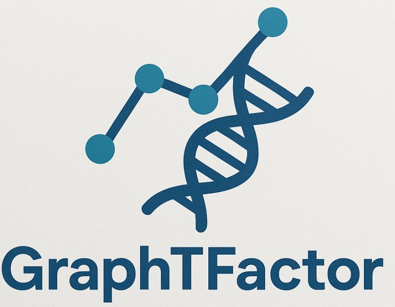
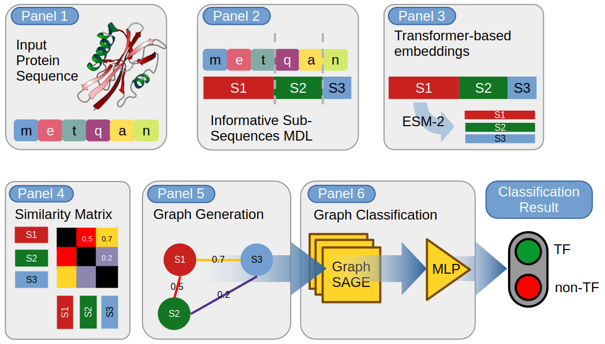

# GraphTFactor

<p align="center">
  
</p>

<p align="center">
  <strong>GraphTFactor: Modeling Protein Sequences as Graphs for Accurate Transcription Factor Prediction.</strong>
</p>

<p align="center">
  <a href="https://pypi.org/">Paper</a> •
  <a href="https://pypi.org/">PyPI</a> •
  <a href="#streamlit-demo">Streamlit Demo</a> •
  <a href="#python-package">Python Package</a> •
  <a href="#citation">Citation</a> 
</p>
---

## Introduction

**GraphTFactor** is a deep-learning framework for protein function prediction based on a graph representation of protein sequences.

Instead of processing a protein sequence only as a conventional string, GraphTFactor converts it into a graph representation. Protein sequences are segmented using a **Minimum Description Length** (MDL) approach, while **ESM embeddings** and sequence similarity are used to represent and characterize the resulting segments.

The resulting graph is processed by a **Graph Neural Network (GNN)** to learn structural representations of the protein and predict its functional class.

### How it works

The GraphTFactor pipeline can be summarized as:

<p align="center">
  
</p>

More specifically:

1. **Protein sequence input**

   GraphTFactor accepts protein sequences in standard FASTA or string formats.

2. **Sequence segmentation**

   The sequence is segmented into informative subsequences using a data-driven segmentation strategy.

3. **ESM-2 embeddings**

   The subsequences are represented trough ESM-2 embeddings.

4. **Graph construction**

   The resulting segments are used to construct a graph representation of the protein.

5. **Node representation**

   Each graph node is associated with a learned or pretrained protein representation.

6. **Graph Neural Network**

   The graph is processed using graph convolution/message-passing layers to capture relationships between sequence segments.

7. **Prediction**

   The learned graph representation is passed to a classifier to obtain the final protein function prediction.

This representation allows GraphTFactor to combine **sequence information, local protein representations, and graph topology** within a unified learning framework.

---

## Key Features

- 🧬 Protein sequence analysis from FASTA files
- 🕸️ Graph representation of protein sequences based on MDL segmentation and ESM-2 embeddings
- 🧠 Graph Neural Network-based prediction
- 🔬 Support for pretrained protein embeddings
- ⚡ GPU acceleration with PyTorch
- 🖥️ Interactive Streamlit interface
- 📦 Installable Python package
- 🔎 Designed for research and large-scale protein analysis

---

# Streamlit Demo

GraphTFactor includes an interactive **Streamlit web application** that allows users to run predictions without writing Python code.

The interface provides a simple workflow:

```text
Upload FASTA
     │
     ▼
Select organism
     │
     ▼
Select model
     │
     ▼
Run GraphTFactor
     │
     ▼
Prediction
```

### Organism Selection

GraphTFactor allows users to select the organism category corresponding to the proteins being analyzed.

The available options are:

| Organism      | Description                                                            |
| ------------- | ---------------------------------------------------------------------- |
| `All`         | General-purpose model trained across all available organism categories |
| `Virus`       | Model configuration for viral proteins                                 |
| `Eukaryotic`  | Model configuration for eukaryotic proteins                            |
| `Prokaryotic` | Model configuration for prokaryotic proteins                           |

The selected organism determines the corresponding model configuration used for prediction.

### ESM-2 Configuration

GraphTFactor supports multiple **ESM-2 models** for generating protein segment embeddings.

The **ESM-2** model is identified by its number of transformer layers. The selected model is used to generate the embeddings of the protein segments obtained through the MDL-based segmentation step.

| ESM-2 #Layers | ESM-2 Model           | Parameters | Embedding Dimension |
| ------------- | --------------------- | ---------- | ------------------- |
| 6             | `esm2_t6_8M_UR50D`    | 8M         | 320                 |
| 12            | `esm2_t12_35M_UR50D`  | 35M        | 480                 |
| 30            | `esm2_t30_150M_UR50D` | 150M       | 640                 |
| 33            | `esm2_t33_650M_UR50D` | 650M       | 1280                |
| 36            | `esm2_t36_3B_UR50D`   | 3B         | 2560                |
| 48            | `esm2_t48_15B_UR50D`  | 15B        | 5120                |

### Demo

<p align="center">
  
</p>

> **Try GraphTFactor interactively:**  
> Add the public Streamlit deployment URL here once available.

---

# Python Package

GraphTFactor is distributed as a Python package through **PyPI**, making it possible to integrate the model directly into existing bioinformatics and machine-learning workflows.

## Installation

Install the latest version with:

```bash
pip install graphtfactor
```

Verify the installation:

```python
import graphtfactor

print(graphtfactor.__version__)
```

---

## Quick Start

A minimal example is:

```python
import torch
from graphtfactor import GraphTFactor

if torch.cuda.is_available():
    device = "cuda"
elif torch.backends.mps.is_available():
    device = "mps"
else:
    device = "cpu"

graphtf = GraphTFactor(device=device,esm_layers=6,org="Virus")


seq = ["MDQYITLVELYIYDCNLFKSKNLKSFYKVHRVPEGDIVPKRRGGQLAGVTKSWVETNLVH"]
prediction,prob = graphtf.predict(seq)

print(prediction,prob)
```

Available computational backend:

```text
CUDA → NVIDIA GPU
MPS  → Apple Silicon GPU
CPU  → CPU fallback
```

---

## FASTA Example

GraphTFactor can be used directly with protein sequences stored in FASTA format:

```python
import torch
import pandas as pd
from graphtfactor import GraphTFactor
from Bio import SeqIO
from tqdm import tqdm

if torch.cuda.is_available():
    device = "cuda"
elif torch.backends.mps.is_available():
    device = "mps"
else:
    device = "cpu"

print(f"Using device: {device}")


mapping = {"no-tf": 0, "tf": 1}

fasta_path = "Virus.fasta"

seqs = []
true_labels = []
ids = []

with open(fasta_path, "r") as fasta_file:
    for record in tqdm(SeqIO.parse(fasta_file, "fasta"),desc="Reading FASTA",unit="sequence"):
        info = record.description.split(" ")

        seq_id = info[0]
        label = info[1]

        seqs.append(str(record.seq))
        true_labels.append(mapping[label])
        ids.append(seq_id)

print(f"Total sequences read: {len(seqs)}")

graphtf = GraphTFactor(device=device,esm_layers=6,org="Virus")

predictions, probas = graphtf.predict(seqs)
label_names = {0: "no-tf",1: "tf"}

predicted_labels = [label_names[int(pred)] for pred in predictions]

true_label_names = [label_names[int(label)] for label in true_labels]

results = pd.DataFrame({
    "ID": ids,
    "True": true_label_names,
    "Predicted": predicted_labels,
    "Probability": probas
})

results["Correct"] = results["True"] == results["Predicted"]

print("\n" + "=" * 70)
print("GraphTFactor Prediction Results")
print("=" * 70)

print(results.to_string(index=False))

print("=" * 70)


```

---

# Citation

If you use **GraphTFactor** in your research, please cite:

---

# License

GraphTFactor is released under the **MIT License**.

See the [`LICENSE`](LICENSE) file for details.

---

# Acknowledgements

GraphTFactor builds upon open-source technologies and pretrained protein language models, including:

- PyTorch
- PyTorch Geometric
- ESM
- Biopython
- scikit-learn
- Streamlit

We acknowledge the developers and research groups behind these projects.

---

# Contact

For questions, feedback, bug reports, or collaboration inquiries, please open an issue in the [GitHub repository](https://github.com/salvatorecalderaro/GraphTFactor).

For research or collaboration inquiries, please contact:

📧 Email: `salvatore.calderaro01@unipa.it`

<p align="center">
  <strong>GraphTFactor</strong><br>
  GraphTFactor: Modeling Protein Sequences as Graphs for Accurate Transcription Factor Prediction.
</p>

---
